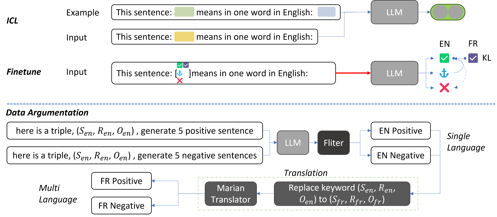

Enhance Large Language Models for Multilingual Sentence Embedding with Knowledge Graph

Sentence representation is a major challenge in natural language processing, especially in multilingual environments. Current approaches to sentence representation using Large Language Models (LLMs) often require large amounts of data for fine-tuning, and research has focused on English content. In addition, comparative datasets translated directly from English can contain many semantic and syntactic errors. To address these issues, we propose a new approach to enhance multilingual sentence embeddings using LLMs and knowledge graphs.
We first present a dedicated designed prompt that exploits in-context learning of LLMs for sentence embedding without fine-tuning.
We further introduce an innovative method that utilizes knowledge graphs, such as Wikidata, for generating diverse multilingual training data for contrastive finetuning. This approach significantly reduces the reliance on translated sentences and mitigates issues related to translation accuracy. Furthermore, we develop a unique multilingual contrastive learning loss function, which, when combined with QLora's efficient fine-tuning technique, enables LLMs to achieve state-of-the-art performance in Sentence Text Similarity (STS) tasks, even with limited computational resources.